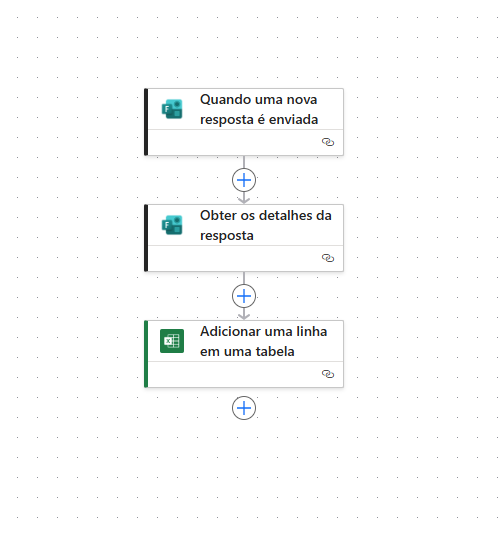
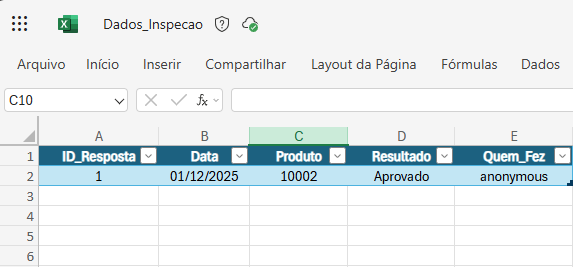

# 📋 Sistema de Coleta de Dados de Inspeção

Automação desenvolvida para eliminar o uso de papel em inspeções de qualidade, garantindo integridade dos dados e centralização em tempo real.

## 📷 Visão Geral do Projeto

| Fluxo de Automação | Banco de Dados (Resultado) |
|:---:|:---:|
|  |  |
| *Captura automática das respostas* | *Dados estruturados no Excel imediatamente* |

---

## 🛠 Tecnologias Utilizadas
* **Microsoft Forms:** Interface de coleta de dados *mobile-friendly* para uso no chão de fábrica.
* **Power Automate:** Orquestração do fluxo de dados (ETL em tempo real).
* **Excel Online (OneDrive for Business):** Armazenamento histórico estruturado em nuvem.

## ⚙️ Arquitetura da Solução
1.  **Input:** Operador envia dados da inspeção via Formulário (Celular/Tablet).
2.  **Gatilho:** O Power Automate detecta a nova resposta instantaneamente.
3.  **Processamento:** O fluxo captura o JSON da resposta (ID, Produto, Status, Quem fez).
4.  **Armazenamento:** Os dados são estruturados e inseridos automaticamente em uma tabela oficial do Excel.

---

## 🏗️ Como foi construído (Passo a Passo)

O projeto foi desenvolvido integrando três ferramentas do ecossistema Microsoft 365:

### 1. Interface de Entrada (Front-end)
* Criação de formulário no **Microsoft Forms** com validação de campos (Data, Seleção de Produto, Status Aprovado/Reprovado).
* Configuração para captura automática do e-mail do respondente (Rastreabilidade).

### 2. Banco de Dados (Back-end)
* Criação de planilha no **Excel Online** hospedada no OneDrive for Business.
* Formatação da área de dados como **Tabela Oficial**, etapa obrigatória para permitir que o Power Automate identifique as colunas (`Produto`, `Resultado`, `Data`) dinamicamente.

### 3. Automação (Middleware)
* **Gatilho (Trigger):** Utilizado o conector *When a new response is submitted* (Quando uma nova resposta é enviada) para iniciar o fluxo instantaneamente.
* **Leitura:** Ação *Get response details* para extrair o conteúdo das respostas usando o ID do gatilho.
* **Gravação:** Ação *Add a row into a table*, onde foi feito o mapeamento dinâmico (De/Para) entre as perguntas do Forms e as colunas do Excel.

---

## 🚀 Impacto do Projeto
* **Eliminação de Digitação:** Fim do retrabalho de passar dados do papel para o computador.
* **Tempo Real:** Os dados ficam disponíveis para análise gerencial no mesmo segundo em que a inspeção ocorre.
* **Confiabilidade:** Redução de erros humanos de transcrição e perda de dados.
